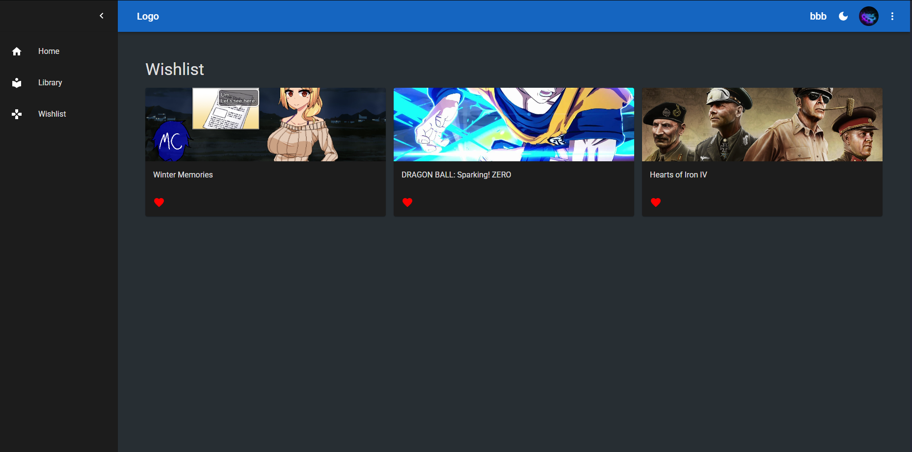

# 🎮 VideoGameLibrary

A full-stack MERN web app where gamers can explore video games, organize their collection, view achievements, and write reviews. Integrates with Steam and RAWG to give you the ultimate game library manager.

🔗 **Live Demo:** [https://videogamelibrary-1.onrender.com](https://videogamelibrary-1.onrender.com)

---

## ✨ Features

- 🔐 Register & Login
- 🕹️ Browse and search games using RAWG API
- 🗂️ Filter games by genre, platform, rating
- ⭐ Add games to Wishlist
- 🎭 Dark/Light theme toggle
- 🔗 Steam Integration:
  - Sync and view owned games
  - View achievements per game
- 📝 Game Reviews:
  - Write and edit your own reviews
  - Display random user reviews from a custom script
- 📱 Fully responsive design

---

## 🛠️ Tech Stack

**Frontend:**
- React
- Redux Toolkit

**Backend:**
- Node.js
- Express
- MongoDB with Mongoose
- JWT for authentication

**External APIs:**
- [RAWG.io API](https://rawg.io/apidocs) for game data
- [Steam Web API](https://steamcommunity.com/dev) for owned games and achievements
- [@faker-js/faker](https://fakerjs.dev) to auto-generate reviews

---

## 🧪 Getting Started – Local Setup
1. Clone the repository:
bash
git clone https://github.com/yourusername/videogamelibrary.git
cd videogamelibrary

2. Install client dependencies:
cd client
npm install

3. Install server dependencies:
cd ../server
npm install

4. Create your .env file inside the server/ directory with the following variables:
MONGO_URL=your_mongodb_connection_string
JWT_SECRET=your_jwt_secret
RAWG_API_KEY=your_rawg_api_key
STEAM_API_KEY=your_steam_api_key

5. Create your .env file inside the server/ directory with the following variables:
# Start backend server
cd server
npm run dev
# Start frontend server
cd client
npm start

---

## 🎲 Generating Random Reviews

To seed the database with fake reviews for your Steam games:
1. Make sure a user exists with a connected Steam profile and synced games.
2. Update the user ID in the generateReviews.js script.
3. Run the script:
node generateReviews.js
✅ This will generate 10 random reviews for each of the first 10 games.

---

## 📸 Screenshots

---

## 🙌 Acknowledgments
- Thanks to [RAWG API](https://rawg.io/apidocs) for providing game data.
- Thanks to [Steam Web API](https://developer.valvesoftware.com/wiki/Steam_Web_API) for Steam integration.
- Thanks to [faker.js](https://fakerjs.dev) for generating fake reviews.
- Inspired by modern game libraries like Steam, Epic, and GOG Galaxy.

---

 ## 👤 Author

**JakubJarosz**  
GitHub: [@JakubJarosz](https://github.com/JakubJarosz)  
Email: jakubtm165@gmail.com 
